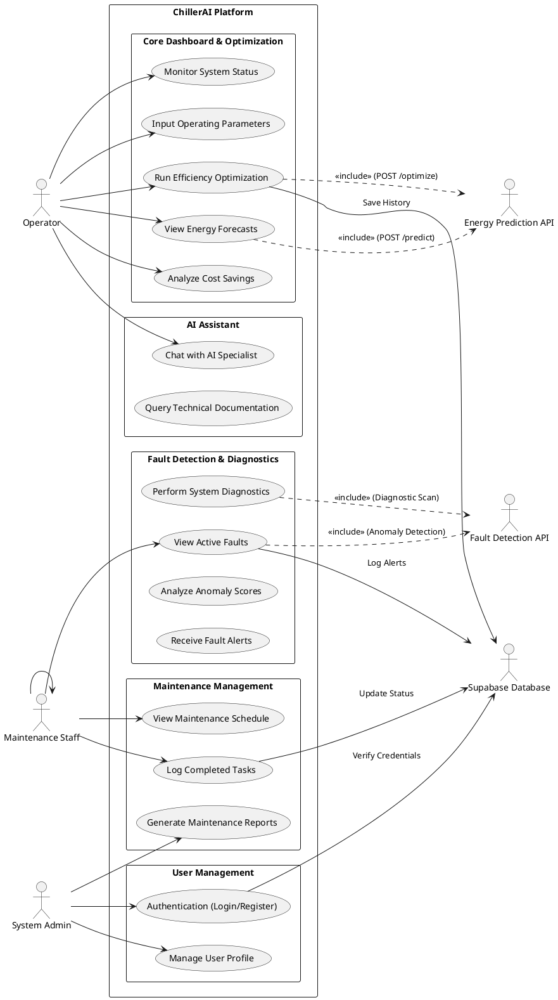

# Global Use Case Diagram: York Chiller Optimizer & Fault Detection System

This document outlines the actors and use cases for the ChillerAI platform, including the integration of AI models for energy prediction, optimization, and fault detection.

## Actors

| Actor | Description |
|-------|-------------|
| **Operator** | Primary user responsible for monitoring and controlling the chiller plant. |
| **Maintenance Staff** | Users responsible for performing scheduled tasks and responding to fault alerts. |
| **System Admin** | Manages system configurations, user access, and data integrations. |
| **Energy Prediction Model (API)** | External/Internal ML service providing efficiency forecasts. |
| **Fault Detection Model (API)** | External/Internal ML service identifying system anomalies. |
| **Supabase (Database)** | Persistent storage for history, tasks, and authentication. |

## Use Case Diagram (PlantUML Representation)

## Detailed Use Case Descriptions

### 1. Energy Prediction & Optimization
*   **Use Case:** Run Efficiency Optimization
*   **Actor:** Operator
*   **Description:** The Operator enters current plant data (load, temperatures, etc.). The system calls the **Energy Prediction API** (`POST /optimize`) to evaluate multiple setpoints and returns the most efficient configuration.
*   **Data Flow:** Frontend -> API (/optimize) -> ML Model -> Response -> Supabase (History).

### 2. Fault Detection & Analysis
*   **Use Case:** Perform System Diagnostics
*   **Actor:** Operator / Maintenance Staff
*   **Description:** User triggers a scan from the Fault Detection page. The system communicates with the **Fault Detection API** to process sensor streams and identify anomalies (e.g., sensor drift, vibration alerts).
*   **Data Flow:** Frontend -> Fault Detection API -> Anomaly Scoring -> Results Display.

### 3. Maintenance Lifecycle
*   **Use Case:** Log Completed Tasks
*   **Actor:** Maintenance Staff
*   **Description:** After performing physical maintenance, the staff member marks the task as completed in the UI. The system updates the next due date based on frequency and logs the history in **Supabase**.

### 4. AI Assistant
*   **Use Case:** Chat with AI Specialist
*   **Actor:** Operator
*   **Description:** The Operator asks questions about plant operations or specific faults. The assistant uses project-specific context (via `assistantContext.js`) to provide grounded answers.

## API Endpoints Integration

| Feature | Endpoint | Method | Purpose |
|---------|----------|--------|---------|
| **Energy Prediction** | `/predict` | `POST` | Get baseline kW/ton for specific conditions. |
| **Optimization** | `/optimize` | `POST` | Compare scenarios to find best setpoint/staging. |
| **Fault Detection** | (Integrated) | `POST` | Scan sensors for vibration and thermal anomalies. |
| **Health Check** | `/health` | `GET` | Verify API status and model availability. |

---
**File Name:** `GLOBAL_USE_CASE_DIAGRAM.md`
